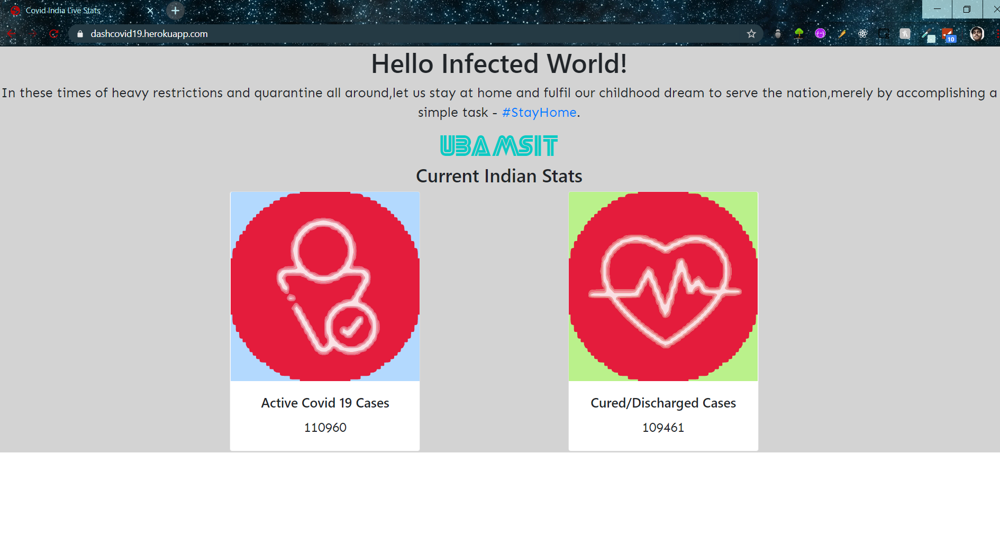
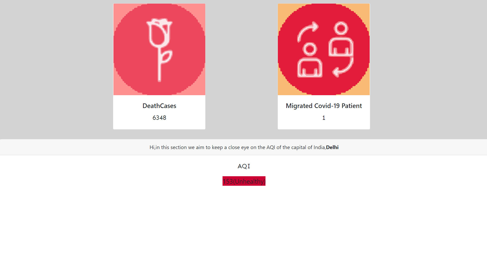

This app informs about the current stats of the Covid-19 epidemic in India.<br>
This app scrapes Covid data from:
```
https://www.mohfw.gov.in/
```
and AQI data from
```
https://aqicn.org/city/delhi/
```
To create locally
```
node app.js
```
Run on browser
```
localhost:3000
```

<h1>SCREENSHOTS</h1>


